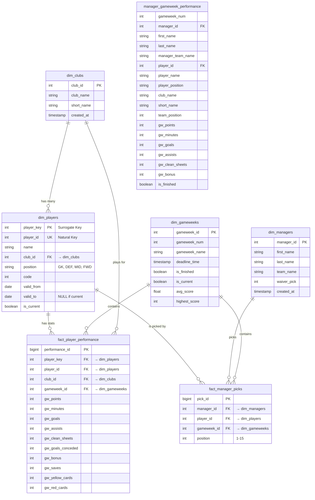

# Entity-Relationship Diagram - FPL ETL Dimensional Model

## Mermaid ER Diagram



## Relationship Descriptions

### 1:N Relationships

| Parent | Child | Relationship | Description |
|--------|-------|--------------|-------------|
| dim_clubs | dim_players | 1:N | One club has many players |
| dim_clubs | fact_player_performance | 1:N | One club has many performances |
| dim_players | fact_player_performance | 1:N | One player has many performances |
| dim_players | fact_manager_picks | 1:N | One player can be picked many times |
| dim_managers | fact_manager_picks | 1:N | One manager has many picks |
| dim_gameweeks | fact_player_performance | 1:N | One gameweek has many performances |
| dim_gameweeks | fact_manager_picks | 1:N | One gameweek has many picks |

### Foreign Key Constraints

```sql
-- fact_player_performance
ALTER TABLE fact_player_performance
  ADD CONSTRAINT fk_player FOREIGN KEY (player_id) REFERENCES dim_players(player_id),
  ADD CONSTRAINT fk_club FOREIGN KEY (club_id) REFERENCES dim_clubs(club_id),
  ADD CONSTRAINT fk_gameweek FOREIGN KEY (gameweek_id) REFERENCES dim_gameweeks(gameweek_id);

-- fact_manager_picks
ALTER TABLE fact_manager_picks
  ADD CONSTRAINT fk_manager FOREIGN KEY (manager_id) REFERENCES dim_managers(manager_id),
  ADD CONSTRAINT fk_player FOREIGN KEY (player_id) REFERENCES dim_players(player_id),
  ADD CONSTRAINT fk_gameweek FOREIGN KEY (gameweek_id) REFERENCES dim_gameweeks(gameweek_id);
```

## Cardinality Summary

```
dim_clubs (1) ──────────────────→ (N) dim_players
    │
    └───────────────────────────→ (N) fact_player_performance

dim_players (1) ─────────────────→ (N) fact_player_performance
    │
    └───────────────────────────→ (N) fact_manager_picks

dim_managers (1) ────────────────→ (N) fact_manager_picks

dim_gameweeks (1) ───────────────→ (N) fact_player_performance
    │
    └───────────────────────────→ (N) fact_manager_picks
```

## Data Flow

```
Bronze Layer (Raw JSON)
    ↓
Silver Layer (Cleaned CSV/Parquet)
    ↓
Gold Layer - Dimensions
    ├── dim_clubs ← From players_raw.json teams
    ├── dim_players ← From players_data.csv + clubs
    ├── dim_managers ← From league_standings.csv
    └── dim_gameweeks ← From players_raw.json events
    ↓
Gold Layer - Facts
    ├── fact_player_performance ← From gameweek parquets + dims
    ├── fact_manager_picks ← From gameweek parquets + dims
    └── manager_gameweek_performance ← Join all above
```
